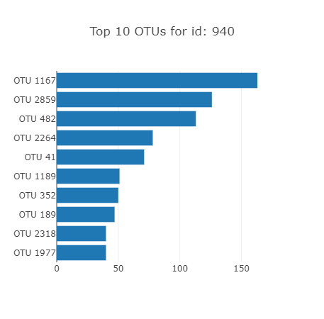
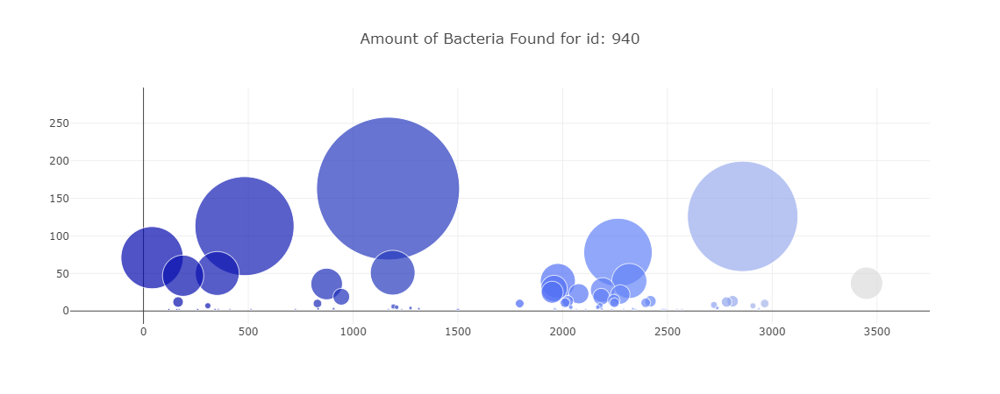

# belly-button-challenge

Module 14 Interactive Visualizations Challenge 

## Description:   

This repo contains all files for necessary for operation of the webpage, including: html and javascript files, which explores data surrounding belly button biodiversity. 

## Technologies  

* html
* javascript
* Visual Studio Code
* 

## Data Source  
All files and data used for this challenge were generated by pulling from the following websit/json file: https://2u-data-curriculum-team.s3.amazonaws.com/dataviz-classroom/v1.1/14-Interactive-Web-Visualizations/02-Homework/samples.json

## Important Documents
* app.js
* index.html
 

## Analysis  
My analysis and notes can be found within the app.js file and the following images. Please note, these images will change based on the user's selection using the Drop Down Menu.
* Drop Down Menu and Demographic Info Summary

* Bar Chart

* Bubble Chart

## Contributors
In order to complete this challenge I utilized/relied on:
* google chrom web browser 'inspect' (DevTools) feature
* multiple google searches, including: d3 utility, javascript trace data, etc.

## Sources: 
- Google DevTools website inspection

